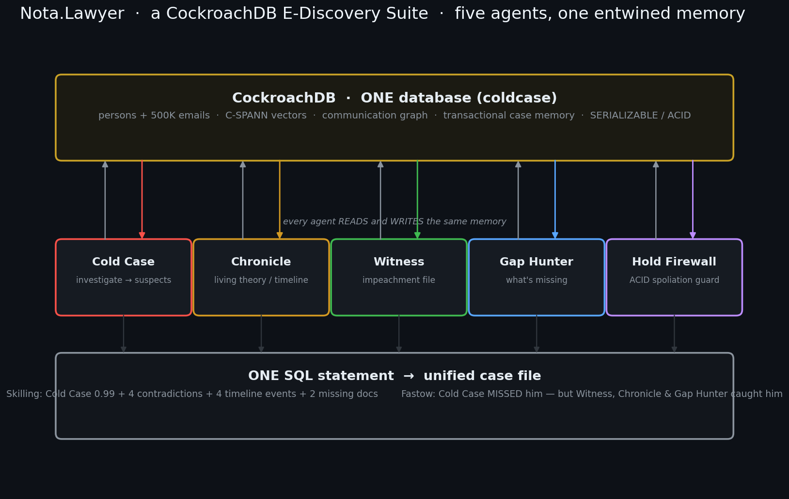

# Nota.Lawyer — a CockroachDB E-Discovery Suite

**CockroachDB × AWS "Build with Agentic Memory"** · five agents, one entwined memory.

> **Metadata is not documentation. It is evidence.**

Five specialized legal agents share **one CockroachDB database**. They don't
just coexist — they read and write the *same* corpus, the *same* people, and
the *same* case memory, and they hand findings to one another. That shared,
transactional, multi-modal memory *is* the product. A bolt-on vector store
cannot do this; CockroachDB can.



---

## The entwinement, proven in one SQL statement

Because all five agents live in one database, a **single query** assembles any
person's complete case file across every agent — vectors, graph, timeline, and
transactional state at once (`src/entwine.py`, run live against the cluster):

```
===== UNIFIED CASE FILE: Skilling  (one SQL statement, five agents, one CockroachDB) =====
  [Chronicle]  timeline       2001-02-12  Jeffrey Skilling becomes CEO
  [Chronicle]  timeline       2001-08-14  Skilling resigns as CEO
  [Chronicle]  timeline       2006-05-25  Lay and Skilling convicted of fraud
  [ColdCase ]  suspicion      score=0.99  Documentary evidence of structuring off-book entities
  [GapHunter]  missing_doc    R04 [open]  Raptor cross-collateralization amendment
  [GapHunter]  missing_doc    R05 [open]  Skilling personal-cell texts (off_channel)
  [Witness  ]  contradiction  "strongest shape it had ever been in" (on resigning, Aug 2001)
  [Witness  ]  contradiction  sold ~$15M of stock "because of post-9/11 fear" (called to sell Sept 6)
  [HoldFirewall] litigation hold ACTIVE on 200 responsive docs (SERIALIZABLE-protected)
```

**The suite catches what one agent misses.** Cold Case never flagged **Andrew
Fastow** from email alone (its documented recall gap) — yet the *same query*
surfaces his 4 timeline events, 2 testimony contradictions, and **3 withheld
documents** from the other agents. No single tool saw the whole picture; the
entwined memory did.

## Five agents — each proves memory changes the *outcome*

Every agent ships an objective **memory ablation**: the same experiment with
persistent memory on and off. In every case, memory doesn't just add speed — it
changes the result.


| Agent | E-discovery job | Memory on vs off | Repo |
|---|---|---|---|
| **Cold Case** | Investigate fraud, name the POIs blind | 4/18 POIs & 100% precision vs 0 | [ColdCase](https://github.com/banksythequantLab/ColdCase) |
| **Chronicle** | Maintain the living theory of the case | converges to truth 0.98 vs oscillates to 0.42 | [Chronicle](https://github.com/banksythequantLab/Chronicle) |
| **Witness** | Build the impeachment file | 12/12 contradictions vs 3/12 | [Witness](https://github.com/banksythequantLab/Witness) |
| **Gap Hunter** | Find what's *missing* | 6/6 gaps @100% precision vs 37% | [GapHunter](https://github.com/banksythequantLab/GapHunter) |
| **Hold Firewall** | Guard against spoliation (ACID) | 0 held docs destroyed vs ~119 | [HoldFirewall](https://github.com/banksythequantLab/HoldFirewall) |

> **Methodology note (read before scoring the numbers).** Cold Case (4/18 vs 0)
> and Hold Firewall (0 vs ~119) run the real pipeline end-to-end against the live
> cluster; Chronicle's timeline is extracted by the live LLM from the SEC
> filings. **Witness and Gap Hunter are *memory-routing* ablations** — both arms
> use the *same* (oracle) detector, so the only variable is persistence. They
> isolate whether memory changes the *outcome*, not detection accuracy; a better
> detector doesn't change the result. Ground-truth sets are deliberately small,
> curated, and sealed (18 / 12 / 6 items) — illustrative of the mechanism, not
> benchmark-scale. Full recall/precision numbers and the honest recall ceiling
> are in `ColdCase/docs/RECALL_RERUN.md`.

## How the memory is entwined

One database, `coldcase`, holds every agent's schema:

```
public.*      shared corpus + Cold Case memory  (persons, emails, C-SPANN email_chunks,
              comm_edges graph, hypotheses/findings/evidence/suspects, hold_docs)
chronicle.*   events, actors, theory_claims, theory_history   (the living timeline)
witness.*     witnesses, statements, contradictions, resolutions (the impeachment file)
gaphunter.*   artifacts, refs, gaps                            (the missing-doc list)
*_truth.*     sealed ground truth per agent (agent roles have no grant — blind evaluation)
```

- **Shared people & corpus.** Cold Case's `persons`/`emails` are the same
  entities Witness, Chronicle, and Gap Hunter reason over — join across schemas
  on the person and the document.
- **State handoff.** Cold Case's suspects seed Witness's witnesses; the corpus
  Cold Case ingests is what Gap Hunter audits for holes; findings feed
  Chronicle's theory; Hold Firewall's SERIALIZABLE guarantee protects every
  write all four make concurrently.
- **One transaction, one truth.** All updates are SERIALIZABLE, so five agents
  writing the shared memory at once never clobber each other (see Hold Firewall).

## Ethical walls & privilege (row-level security)

The legal industry's top fear about shared AI memory is cross-matter
contamination and privilege waiver. CockroachDB **row-level security** enforces
the wall in the *database*, not in application code (`src/prove_ethwall.py`):

```
[reviewer_a] (Matter A) can SELECT 1 row:  Matter A - responsive email
[reviewer_b] (Matter B) can SELECT 1 row:  Matter B - responsive email
[privilege_team]        can SELECT 4 rows: both matters, incl. privileged
WALL CHECK -- reviewer_a can see any Matter B row: False   (must be False)
PRIVILEGE  -- reviewer_a can see any privileged row: False (must be False)
```

RLS policies scoped to roles (`CREATE POLICY wall_a ON documents TO reviewer_a
USING (matter='A' AND NOT is_privileged)`) mean a reviewer *physically cannot*
read another matter's rows or a privileged document — the query returns zero
rows, not a filtered-in-code result. This generalizes Cold Case's sealed-
conviction RBAC trick into a real, defensible legal-compliance mechanism.
Run: `py -3.11 src/prove_ethwall.py`.

## Vector + graph fusion retrieval (one SQL statement)

The recall ceiling comes from using the two signals *separately*: C-SPANN vector
search knows whose email *content* matches a fraud query; the 363K-edge
communication graph knows who *talks to* them. `ColdCase/src/fusion_retriever.py`
fuses both in **one SQL statement** — vector-rank a seed, graph-expand over
`comm_edges`, re-rank by a blended score:

```
FUSED vector + graph, top finds the pure vector ranked NOWHERE (vsim ~ 0):
    KITCHEN LOUISE          v=0.00 g=20.1   <- graph-only
    sara.shackleton@enron   v=0.00 g=19.1   <- graph-only  (LJM in-house counsel)
    LAVORATO JOHN J         v=0.00 g=16.1   <- graph-only
    elizabeth.sager@enron   v=0.00 g=12.6   <- graph-only  (LJM in-house counsel)
```

4 of the fused top-20 are real fraud-network figures that pure vector search
ranks nowhere — surfaced purely by the graph, in the same engine. This is the
answer to "why CockroachDB, not a vector store": ANN + graph joins + one query.

**Honest limit:** even fusion does *not* surface Andrew Fastow — he is minimally
present in *both* email modalities (few sent mails, low-volume edges). His signal
is in the SEC filings (Chronicle) and off-channel gaps (Gap Hunter). No single
modality finds him; the **entwined cross-agent memory** does — which is the whole
thesis. Run: `py -3.11 ColdCase/src/fusion_retriever.py`.

## CockroachDB & AWS

- **CockroachDB tools:** Distributed Vector Indexing (C-SPANN) on 500K+ email
  chunks and SEC filings; Managed MCP Server (judges interrogate the live case
  memory in plain English); ccloud CLI (agent-triggered backups); Agent Skills
  (schema/ops) — well beyond the 2-tool minimum. Plus the CockroachDB-native
  properties no vector store has: **SERIALIZABLE** (Hold Firewall),
  **row-level security** (ethical walls), and **follower reads**
  (`AS OF SYSTEM TIME follower_read_timestamp()`) that serve read-heavy
  dashboard queries from a replica, isolated from the contended write path.
- **AWS:** S3 (corpus + case snapshots), plus the deployed demo dashboard.

## Live demo & video

- **Dashboard:** the Cold Case suspect-board is the functional demo app —
  suspects, evidence, timeline, network graph, SEC filings, and the replay view,
  all reading CockroachDB directly.
- **Demo + narrated walkthrough:** see the Cold Case repo for the deployed URL
  and the sub-3-minute video.

## Entity resolution (the join key)

The unified case file joins agents on a **resolved identity**, not a raw name.
The corpus fragments each principal across many records — Andrew Fastow has 7,
with a decoy (**Lea** Fastow, `lfastow@`) that must *not* resolve to him — and
homonyms abound (Jeffrey vs Mark vs Ken Skilling; Richard vs Annette vs Ginger
Causey; Sherron vs 10 other Watkinses). `identity.entities` + `identity.aliases`
(built by `src/build_identity.py`) map each principal's name variants **and**
its specific `person_id`s to one canonical entity. The live dashboard shows the
resolution ("unified 9 person records & 13 aliases into one identity") and Cold
Case then matches on the resolved `person_id`s, not a brittle name string.

## Run the entwinement proof

```
py -3.11 src/build_identity.py     # resolve principal identities (aliases + person_ids)
py -3.11 src/entwine.py            # unified case file for Skilling + Fastow
py -3.11 src/entwine.py Lay Causey # any principals you like
py -3.11 src/make_architecture.py  # regenerate docs/architecture.png
```

Requires `CRDB_ADMIN_URL`; deterministic, no GPU.

## Status

Live and verified against CockroachDB v25.4: all five agents, the shared schema,
the five memory ablations, and the one-statement unified case file. Deferred to
the project GPU: the LLM extraction layers that grow Chronicle's timeline,
Witness's statements, and Gap Hunter's references directly from the raw corpus.

MIT licensed. One memory backbone. Five legal agents. **Entwined.**
